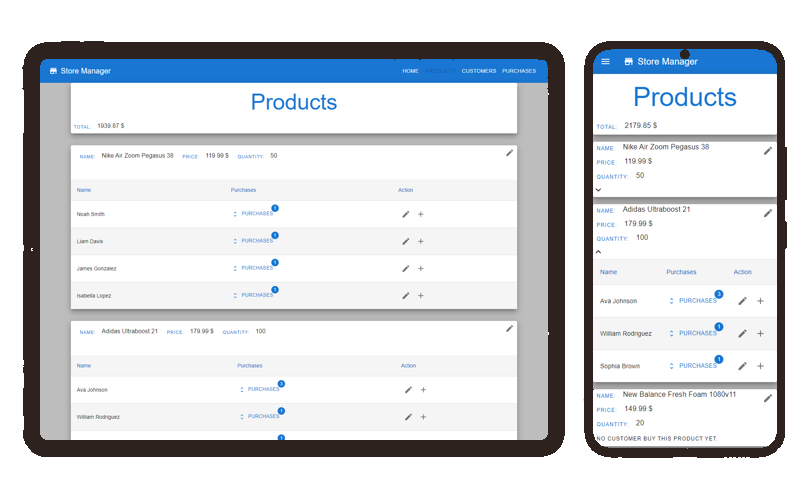
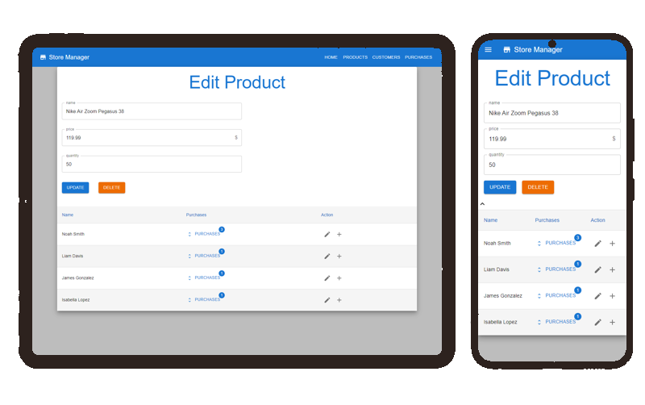
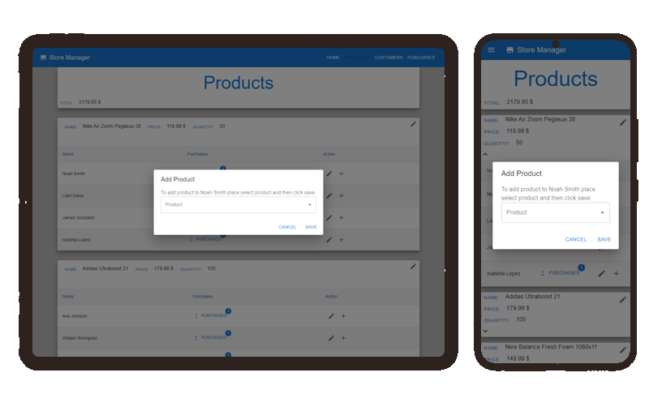
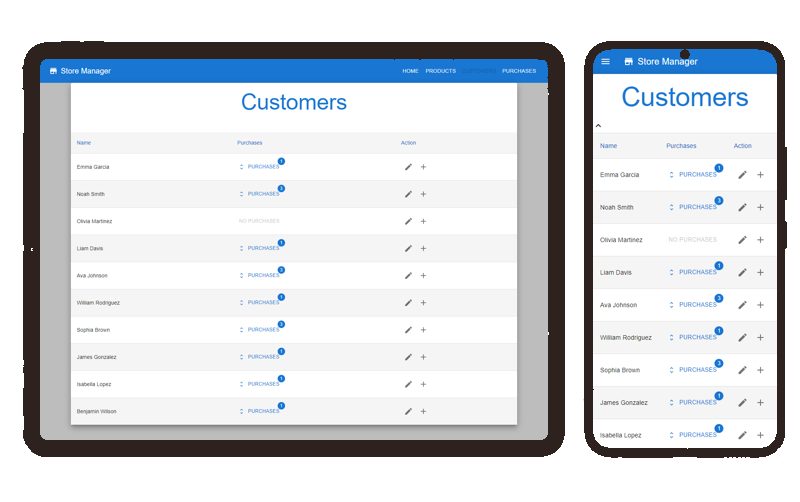
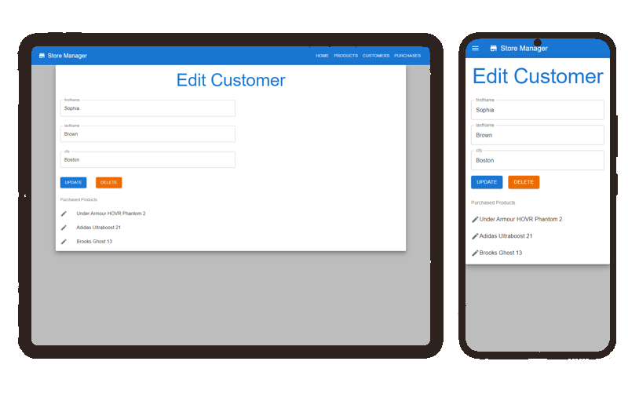
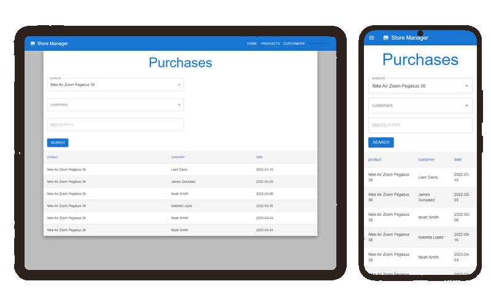

# Managing Store
The Managing Store React app is a client-side web application designed for managing products, customers, and purchases in a store. Built using React, Redux, and Material-UI (MUI) technologies, this app provides a interface for viewing, editing, and deleting products and customers, while also offering search functionality for purchases.

## Pages

### Products
This page displays products in cards. Each product card displays product properties, as well as a table of customers who have purchased the product. Each row in the table has two buttons for editing the customer and adding a product to the customer. The product card also has an edit button that redirects the user to the edit page for that product.  
  
  
  

### Customers
This page displays a table with all the customers. Each row in the table displays the customer's name, their purchases, and two buttons for editing the customer and adding a product to the customer.  
  
  

### Purchases
This page displays a search engine for searching purchases. It has three fields for product, customer, and date, and a search button. The data filled in the fields can be passed via the URL for searching purchases.  
  

## architecture
The architecture of the project is split into two main types of components: UI components and Flow components.
* Flow Components - The Flow components are responsible for access the data and business logic of the application. They are aware of the data and interact with Redux for data management. However, they do not directly access UI libraries like Material UI. Instead, they access the UI components, which are responsible for rendering the data in the desired style.
* UI Components - The UI components are responsible for managing the style and appearance of the application. They are aware of style and do not directly access the data or Redux state manager. The data is passed to the UI components via props.

## Technology Stack
- React: For building the user interface and components.
- Material-UI (MUI): For styling and UI components.
- Redux: For managing the application state and data.

## Features
* Responsive UI: The app's user interface is responsive and optimized for both mobile and desktop devices.
* Automatic Data Update: The app uses Redux as a state management library, which automatically updates all components that use the same data without requiring a page refresh.
* My owen Flow and UI Components architecture
* Search Engine for Purchases with URL Parameter Support.
* View Products, Customers, and Purchases.
* Edit Products and Customers.
* Delete Products and Customers.

## Installation

To run the project locally, follow these steps:

1. Clone the repository to your local machine:

```bash
git clone <repository-url>
```

2. Navigate to the project directory:

```bash
cd managing-store
```

3. Install the dependencies using npm:

```bash
npm install
```

4. Start the development server:

```bash
npm start
```

This will start the React development server and the application will be accessible at `http://localhost:3000` in your web browser.

Note: Make sure you have Node.js and npm installed on your machine before running the above commands.

Note: Since the data is stored locally on the client side, it may not persist across different devices or browsers. Any changes made to the data will only be reflected on the current device/browser.
